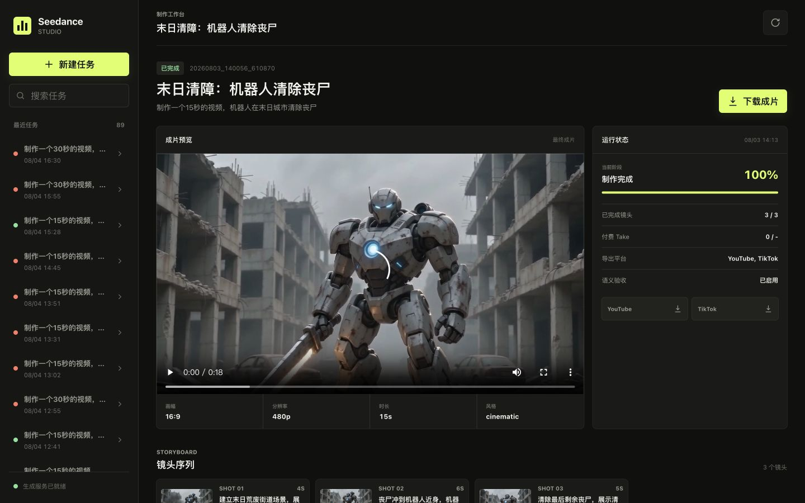

# Seedance


一个可恢复、可验证的 AI 短视频生产流水线。输入一句中文需求，即可完成生产计划、分镜、视频片段、转场、调色、配乐、口播、字幕和多平台导出。

项目通过火山引擎 Ark 调用 Seedance 2.0 Mini，并同时提供 Web 工作台和 CLI。它不会把长提示词直接交给视频模型，而是先编译为可验证的生产计划，再按镜头顺序生成和验收。

> [!IMPORTANT]
> 本项目是非官方实现。模型可用性、接口参数和价格以[火山方舟官方文档](https://www.volcengine.com/docs/82379)为准。真实生成会调用付费服务。

## Web 工作台



工作台可创建任务、查看已有工作区、跟踪镜头进度、恢复中断任务，以及预览和下载成片。它直接复用 CLI 的 `VideoPipeline`、运行账本和恢复规则，不维护第二套生成逻辑。

```bash
python web_server.py
```

打开 <http://127.0.0.1:8765>。服务默认只监听本机地址；关闭浏览器不会中断服务端正在执行的任务。

## 核心能力

- **结构化生产计划**：把自然语言需求拆成有时长、故事状态、动作因果与镜头职责的分镜。
- **统一动作合约**：用 Action Contract 表达接触、定向路径、区域与间接作用，限制结果范围并检查因果顺序。
- **连续性传递**：同场景镜头使用上一条已接受镜头的真实尾帧作为 `first_frame`，跨场景才切换独立身份参考。
- **双层质量检查**：执行技术质量检查和可选的时序语义验收，失败只允许有限、定向的处理。
- **安全恢复**：持久化任务 ID、提示词指纹、合约签名、参考职责和验收上下文，避免恢复时重复提交付费任务。
- **完整后期链路**：自动完成规格统一、转场、BGM、TTS、LUT、字幕、片头与多平台导出。
- **双入口**：Web 工作台和 CLI 共享同一套流水线与工作区格式。

## 工作原理

```text
用户需求
  -> 生产计划与故事骨架
  -> 分镜详情与生成前就绪校验
  -> 严格顺序视频生成
  -> 技术 QA + 可选语义验收
  -> 已接受终态交接到下一镜
  -> 规格统一 / 转场 / 音频 / 调色 / 字幕 / 导出
```

对动作镜头，系统把准备、作用、结果与范围外主体拆到结构化合同中。Provider 提示词、安全重编译、语义验收和定向重拍共享同一合同投影，避免为单个题材添加关键词补丁。

恢复时，已接受的本地片段只会在验收上下文匹配时复用；上下文变化会先触发离线复核。远端未决任务只轮询原任务，不重新提交。已返回但本地下载或技术 QA 失败的任务会停止，避免隐式重复扣费。

## 环境要求

- Python 3.11 或 3.12。Python 3.14 目前会触发 Ark SDK 的 Pydantic V1 兼容警告。
- [FFmpeg](https://ffmpeg.org/download.html) 与 `ffprobe`。
- 已开通 Seedance 2.0 Mini 的火山方舟 API Key。
- macOS 默认使用系统 `say` 生成口播；其他系统可配置豆包语音合成。

安装 FFmpeg：

```bash
# macOS
brew install ffmpeg

# Ubuntu / Debian
sudo apt install ffmpeg
```

确认本地环境：

```bash
python --version
ffmpeg -version
python main.py --help
```

## 快速开始

### 1. 安装依赖

```bash
python -m pip install -r requirements.txt
```

### 2. 配置环境变量

```bash
cp .env.example .env
```

编辑 `.env`，至少填写：

```dotenv
ARK_API_KEY=your_ark_api_key
```

### 3. 启动 Web 工作台

```bash
python web_server.py
```

或者直接使用 CLI：

```bash
python main.py "制作一个15秒的视频，机器人在末日城市清除丧尸"
```

首次生成会创建独立的 `output/<run_id>/` 工作区。不要提交 `.env`、`output/` 或其中可能包含的私有媒体。

## CLI 用法

```bash
# 基础生成
python main.py "15秒咖啡品牌广告，从咖啡豆到拿铁的过程"

# 720p 与指定风格
python main.py "科技感产品介绍" --resolution 720p --style futuristic

# 竖版与指定导出平台
python main.py "旅行短视频" --ratio 9:16 --platforms tiktok instagram_reels

# 指定背景音乐
python main.py "运动品牌宣传" --music music/upbeat_electronic.mp3

# 限制本次运行允许提交的付费 Take 数量
python main.py "30秒末日动作短片" --paid-take-budget 8

# 从已有工作区恢复
python main.py --resume output/20260730_153000_123456
```

支持的输出规格：

| 类型 | 可选值 | 默认值 |
| --- | --- | --- |
| 分辨率 | `480p`、`720p` | `480p` |
| 画幅 | `16:9`、`9:16`、`4:3`、`1:1`、`3:4`、`21:9` | `16:9` |
| 平台 | `youtube`、`tiktok`、`bilibili`、`instagram_reels`、`instagram_feed` | `youtube`、`tiktok` |

请求 `720p` 时，生成链允许同模型降级到 `480p`。完整参数以 `python main.py --help` 为准。

## 配置

默认值由 [`.env.example`](.env.example) 和 [`config.py`](config.py) 共同定义。

| 变量 | 必填 | 说明 |
| --- | --- | --- |
| `ARK_API_KEY` | 是 | Ark 默认 API Key，供 LLM 与视频接口使用。 |
| `ARK_API_KEY_SEEDANCE` | 否 | 视频生成专用 Key；未设置时复用 `ARK_API_KEY`。 |
| `ARK_BASE_URL` | 否 | 分镜 LLM 接口。 |
| `ARK_BASE_URL_SEEDANCE` | 否 | Seedance 视频生成接口。 |
| `SEEDANCE_MODEL` | 否 | 视频模型，默认 `doubao-seedance-2-0-mini-260615`。 |
| `LLM_MODEL` | 否 | 分镜文本模型，默认 `doubao-seed-2.0-lite`。 |
| `SEMANTIC_REVIEW_MODEL` | 否 | 语义验收模型，默认复用 `LLM_MODEL`。 |
| `SEMANTIC_REVIEW_ENABLED` | 否 | 是否启用语义验收，默认 `true`。关闭后仅记录技术验收。 |
| `SEMANTIC_REVIEW_IMAGE_DETAIL` | 否 | 语义验收图片细节级别，默认 `high`。 |
| `TTS_ENGINE` | 否 | `macos` 或 `volcano`，默认 `macos`。 |
| `TTS_VOICE` | 否 | macOS 口播音色，默认 `Tingting`。 |
| `VOLCANO_TTS_API_KEY` | 否 | 使用 `TTS_ENGINE=volcano` 时需要。 |

## 恢复与费用安全

真实生成会调用付费的 LLM、视频生成、可选语义验收和可选 TTS 服务。

- `--resume` 使用原运行参数，不能同时覆盖画幅、风格、音乐、平台或付费 Take 预算。
- 已提交但未决的远端任务会记录不可变提交描述符；恢复时仅轮询同一任务 ID。
- 下载暂时失败后会继续获取同一结果，不创建第二个任务。
- 已接受镜头会复用；验收上下文变化时先离线复核，不降低质量门强行放行。
- 语义失败最多触发一次定向重拍；被拒片段不会成为后续镜头的状态或身份参考。
- `--paid-take-budget N` 在提交前预留授权并写入 `run_manifest.json`；轮询已有任务不消耗新预算。
- 只有已验收且成功提取的身份锚点才能重置 `Reference Chain Depth`。
- 本地物化或技术 QA 失败会显式停止，不授权恢复流程自动提交新的付费任务。

自动化测试不应使用真实 Key 或真实视频生成任务。

## 输出目录

```text
output/<run_id>/
├── storyboard.json          # 已确认的分镜
├── run_manifest.json        # 参数、镜头状态、恢复与验收元数据
├── generation_results.json  # 片段生成结果
├── shots/                   # 原始镜头、尾帧与生成谱系
├── normalized/              # 统一规格后的片段
├── semantic_reviews/        # 本地语义验收缓存
├── exports/                 # 平台导出文件
└── final.mp4                # 最终成片
```

工作区是恢复的唯一依据。移动或清理其中的 `run_manifest.json`、镜头、尾帧或谱系文件，会使恢复流程无法安全判断状态并主动停止。

## 项目结构

```text
seedance/
├── main.py                 # CLI 入口
├── web_server.py           # Web 工作台服务入口
├── web/                    # 原生 HTML、CSS 与 JavaScript 界面
├── config.py               # 支持规格、模型与运行默认值
├── pipeline/               # 分镜、合约、生成、验收、恢复与编排
├── tools/                  # Ark、FFmpeg、TTS、节拍与帧处理
├── prompts/                # 分镜系统提示词
├── luts/                   # LUT 调色文件
├── music/                  # 本地背景音乐库
├── assets/screenshots/     # README 截图
├── tests/                  # 离线测试
├── docs/adr/               # 架构决策记录
└── output/                 # 每次运行的独立工作区
```

主要代码入口：`main.py`、`web_server.py`、`pipeline/orchestrator.py`、`pipeline/storyboard.py`、`pipeline/generator.py`、`pipeline/run_state.py`。

## 测试

测试使用本地 fixture、模拟 Provider 和临时工作区，不会调用真实 Ark/Seedance API，也不会产生视频生成费用。

```bash
# 完整回归测试
python -m pytest -q

# Python 编译检查
python -m compileall -q pipeline tests
```

测试覆盖分镜合约、时长与规格约束、Provider 参数、动作因果、状态恢复、转场、音频时间线和 Web 适配层。离线行为评测矩阵覆盖 15/30 秒、action/product/balanced、单/多角色、同/跨场景、四种交互模式以及 normal/policy-safe 编译。

## 设计取舍

本项目吸收下列开源项目的可迁移思想，但不复制其实现或技术栈：

| 项目 | 借鉴方向 | 本项目的实现边界 |
| --- | --- | --- |
| [FireRed-OpenStoryline](https://github.com/FireRedTeam/FireRed-OpenStoryline) | 长叙事拆分与故事状态 | 使用受限 Story Spine 与逐镜状态交接。 |
| [Remotion](https://github.com/remotion-dev/remotion) | 可组合、可复现的视频时间线 | 使用确定性时长、转场与音频时间计算，不引入 React 渲染栈。 |
| [MoneyPrinterTurbo](https://github.com/harry0703/MoneyPrinterTurbo) | 自动化内容生产流程 | 保留可运行工作区与素材处理，不复制其产品工作流。 |
| [moyin-creator](https://github.com/MemeCalculate/moyin-creator) | 叙事、视觉描述与拍摄控制分层 | 将角色资产、镜头调度、相机与生成提示词分阶段编译。 |
| [ViMax](https://github.com/HKUDS/ViMax) | 规划、角色与事件提取、执行分离 | 使用整体故事弧、逐镜状态与生成就绪门。 |
| [OpenMontage](https://github.com/calesthio/OpenMontage) | 生成前质量门与帧采样复核 | 使用就绪校验、时序语义验收、有限重拍与发布校验。 |
| [seedance-2.0](https://github.com/Emily2040/seedance-2.0) | Seedance 调用经验 | 以官方 Ark 接口和本项目的持久化恢复边界为准。 |

单一 Action Contract 的架构决策见 [`docs/adr/0001-single-action-contract-owner.md`](docs/adr/0001-single-action-contract-owner.md)。

## 已知限制

- Seedance 2.0 Mini 当前仅支持 `480p` 与 `720p`，不支持 `1080p`。
- 生成式视频仍可能出现主体漂移、复杂交互失真、文字渲染错误或物理因果不稳定。
- 语义验收会提高可靠性，但同时增加模型调用、运行时间与费用。
- 同场景连续性依赖上一镜已接受尾帧；尾帧不可用或被接口拒绝时，流水线会停止依赖镜头。
- Linux 和 Windows 默认没有 macOS `say`，需要配置豆包语音或接受无口播输出。
- 背景音乐和 LUT 依赖本地文件；文件缺失时会跳过对应处理或使用可用替代路径。
- 转场重叠和实际片段时长可能使最终时长与目标时长存在合理偏差。

## 贡献

提交 Issue 时请附上复现命令、完整错误信息，以及可脱敏的 `output/<run_id>/run_manifest.json`。不要提交 `.env`、API Key、私有素材或完整付费生成产物。

提交 Pull Request 前请运行测试和编译检查。生成、恢复或验收相关改动必须使用模拟 Provider 覆盖，不得把真实付费生成作为自动化测试步骤。

## License

本项目基于 [MIT License](LICENSE) 发布。
